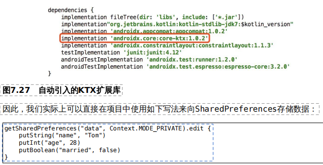

**第七章**
1、高阶函数的应用
除了课本，可以扩展几个用法...
1.1、SharedPreference
LearnKtC6_C7.kt 搜索关键词，看用法
*fun spHiOrderFun()*
*inline fun SharedPreferences.putData()*
KTX扩展库中已经提供过了上述用法


1.2、ContentValue
~在Kotlin中使用A to B这样的语法结构会创建一个Pair对象
```kotlin
fun cvOf(vararg pairs: Pair<String, Any?>) = ContentValues().apply {
    for (pair in pairs) {
        val key = pair.first
        val value = pair.second
        when (value) {
            is Int -> put(key, value)
            is Long -> put(key, value)
            is Short -> put(key, value)
            is Float -> put(key, value)
            is Double -> put(key, value)
            is Boolean -> put(key, value)
            is String -> put(key, value)
            is Byte -> put(key, value)
            is ByteArray -> put(key, value)
            null -> putNull(key)
        }
    }
}
```
Q:为什么要用 when 对 value 做条件判断（遍历）？


KTX库中也提供了一个具有同样功能的contentValuesOf()方法


**第八章**
泛型和委托，高级知识
1、泛型
定义泛型类和泛型方法。语法结构都是<T>。T是约定俗成的写法，任何字母都可以。
```kotlin
class MyClass<T> {
    fun funcT(param:T):T{
        return param
    }
}

val my = MyClass<Int>()
my.funcT(3)
```
单独定义泛型方法：
```kotlin
class MyClass{
    fun <T> funcxx(param:T):T{
        return param
    }

    //指定泛型类型，泛型约束。Number类型
    fun <T:Number> funcT2(param:T):T{
        return param
    }
}

val my = MyClass()
my.funcxx<String>("")
//kt出色的类型推导机制
my.funcxx("")
my.funcxx(4)
my.funcxx(MyClass())
```
结合泛型实现apply功能
```kotlin
import android.content.ContentResolver
import android.content.ContentValues

fun <T> T.build2(block:T.()->Unit):T{
    block()
    return this
}

StringBuilder().build2 { append("xxx") }
4.build2 { +2 }
//使用上面build2简化contentResolver or map的遍历
val contentResolver = android.content.ContentResolver()
contentResolver.query()
//
val map = mapOf(1 to "a",2 to "b",3 to "c")
map.build2 { 
    for((keya,valueb) in this) {
        println("$keya,$valueb")
    }
    put(4,"d")//会报错，mapOf不可变集合
}
```
2、类委托和委托属性
委托是一种设计模式，委托给另一个辅助对象去处理。
类委托 关键字by
```kotlin
class MySet<T>(val helperSet: HashSet<T>) : Set<T> {
    override val size: Int get() = helperSet.size
    override fun isEmpty(): Boolean {
            return helperSet.isEmpty()
        } 
    override fun iterator(): Iterator<T> {
            return helperSet.iterator()
        } 
    override fun containsAll(elements: Collection<T>): Boolean =helperSet.containsAll(elements)
    override fun contains(element: T): Boolean {
            TODO("Not yet implemented")
        }

}
//by 委托关键字魔法,简化上述代码.只需关注自己的扩展功能
class MySet2<T>(val helperSet:HashSet<T>):Set<T> by helperSet{
    fun printHello() = println("hello")
}
```
[委托属性]的核心思想是将一个属性（字段）的具体实现委托给另一个类去完成。
解密 懒加载 by lazy{}

```kotlin
//调用p属性后得到的值就是Lambda表达式中最后一行代码的返回值
val p by lazy {
    val matcher = UriMatcher(UriMatcher.NO_MATCH)
    matcher.addURI(authority, "book", bookDir)
    matcher.addURI(authority, "book/#", bookItem)
    matcher.addURI(authority, "category", categoryDir)
    matcher.addURI(authority, "category/#", categoryItem)
    matcher
}

fun UriMatcher(noMatch: Any): Any {
}
```

**第九章**
1、infix函数
A to B:to 不是关键字，是函数的高级语法糖特性。实际上等价于A.to(B)的写法
```kotlin
infix fun String.beginWith(preString:String) = startsWith(preString)

"hello,kt".startsWith("hello")
"hello,kt" beginWith "hello"
```
infix函数允许我们将函数调用时的小数点、括号等计算机相关的语法去掉，从而使用一种更
接近英语的语法来编写程序，让代码看起来更加具有可读性。
条件限制：不能是顶层函数；只能接收一个参数。
高级一点的用法：
```kotlin
infix fun <T> Collection<T>.hasSameElem(elem:T) = contains(elem)

listOf(1,2,3,4,5) hasSameElem 4

//
infix fun <A,B> A.with(that:B) = Pair(this,that)
mapOf( 1 to 10,2 to 20)
//等同于
mapOf(1 with 10,2 with 20)
```

**第十章**
1、泛型的高级特性
kotlin特有的功能
kt泛型实化，java泛型擦除。Java的泛型功能是通过类型擦除机制来实现的。
kt该怎么写才能将泛型实化呢？首先，该函数必须是内联函数才行，也就是要用inline
关键字来修饰该函数。其次，在声明泛型的地方必须加上reified关键字来表示该泛型要进行实化。

```kotlin
inline fun <reified : T> getDetailType() {}
inline fun <reified : T> getRefiedType2() = T::class.java

val result = getRefiedType2<String>()
println("result is $result")//result is java.lang.String
```
2、泛型实化的应用

```kotlin
import android.content.Context
import android.content.Intent

//泛型实化函数应用 inline fun reified
inline fun <reifeid : T> startActivityByLoon(ctx: Context, block:android.content.Intent.()->Unit){
    val intent = android.content.Intent(ctx,T::class.java)
    intent.block()
    startActivity(intent)
}

startActivityByLoon<loonActivity>(context){
    putExtra("name","loonn")
}
```

3、泛型的 协变&逆变，后续学习


**第十一章**
1、协程编写高效并发程序
协程 轻量级的线程，满足并发效率。
需要添加外部依赖库：
implementation "org.jetbrains.kotlinx:kotlinx-coroutines-core:1.1.1"
implementation "org.jetbrains.kotlinx:kotlinx-coroutines-android:1.1.1“//android中会用到
1.1 
```kotlin
Global.launch { //开启一个顶层协程，随应用程序启动一起启动，结束一起结束
     delay(1500)//延时函数，挂起当前协程，非阻塞式。Thread.sleep(100),是阻塞式
}

runBlocking{ //等在协程代码块运行完了，应用程序才会结束。保证代码运行完成之前，一直阻塞当前线程。正式使用会产生性能问题，一般测试时使用
创建多个协程/launch函数必须在协程作用域中才能调用
    launch{
        
    }
    
    launch{
        
    }
开启100000个协程/耗时500ms/体现出高效/如果是线程/可能不太可能/已经oom
    repeat(100000) { 
        launch{
            println("$it")
            printIndex(it)
            delay(1000)
        }
    }
}

协程中调用函数/函数添加协程作用域/suspend关键字*挂起函数*后就可以在函数中调用delay函数了
suspend fun printIndex(index: Int){ 
    println("$index")
    delay(1000)
}


```
coroutineScope {} 是一个挂起[函数]，集成外部协程作用于并创建一个子协程。可以被其他挂起函数调用，为他们提供协程作用域。
他会挂起外部协程，直到coroutineScope函数都执行完了，之后的代码才能运行。
与runBlocking不同，他只阻塞当前协程，不影响其他协程，也不影响其他线程。

2、常见的协程使用场景

```kotlin
val job = Job()
val scope = CoroutineScope(job)
scope.launch{
    
}
job.cancel()
```
~CoroutineScope(job)是方法，返回一个CoroutineScope对象 interface
~launch也是一个方法，返回一个job对象。怎么获取代码块的返回结果呢？
这样所有scope创建的协程都会被关联在job对象下面。只需要调用一次，就可以将同一作用域的所有协程取消。

async函数可以获取结果。

```kotlin
import kotlin.coroutines.CoroutineContext

val job = Job()
val scope = CoroutineScope(job)
val result = scope.async {
    5 + 5
}.await()
println("$result")//10
```
~await()会阻塞协程，直到获取到结果。
高效办法，在需要的地方去调用await(),防止协程阻塞，提高并行效率。
[请看xxx35.kt]

withContext(Dispatchers.IO){}作用域构建器,IO(高并发，大多时间在阻塞和等待)、Main(主线程，android项目特用)、Default(低并发，计算密集)
也有返回结果，阻塞式挂起外部协程。
suspendCoroutine{}函数,将协程挂起。接收一个lambda{continuation->}调用continuation.resume可以让协程恢复执行。作用：简化匿名类回调写法，例如网络请求。


