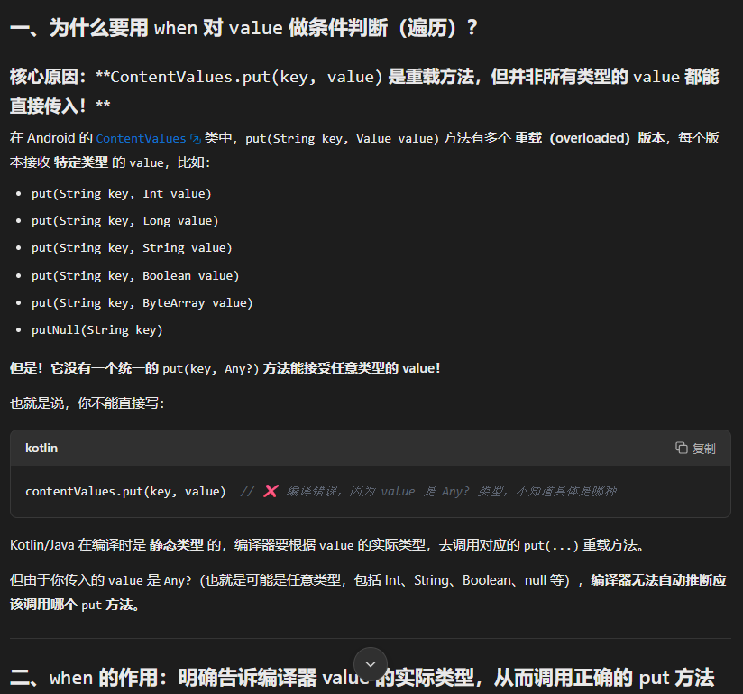

**第七章**
1、高阶函数的应用
除了课本，可以扩展几个用法...
1.1、SharedPreference
xxx3.kt 搜索关键词，看用法
*fun spHiOrderFun()*
*inline fun SharedPreferences.putData()*
KTX扩展库中已经提供过了上述用法


1.2、ContentValue
~在Kotlin中使用A to B这样的语法结构会创建一个Pair对象
```kotlin
fun cvOf(vararg pairs: Pair<String, Any?>) = ContentValues().apply {
    for (pair in pairs) {
        val key = pair.first
        val value = pair.second
        when (value) {
            is Int -> put(key, value)
            is Long -> put(key, value)
            is Short -> put(key, value)
            is Float -> put(key, value)
            is Double -> put(key, value)
            is Boolean -> put(key, value)
            is String -> put(key, value)
            is Byte -> put(key, value)
            is ByteArray -> put(key, value)
            null -> putNull(key)
        }
    }
}
```
Q:为什么要用 when 对 value 做条件判断（遍历）？


KTX库中也提供了一个具有同样功能的contentValuesOf()方法


**第八章**
